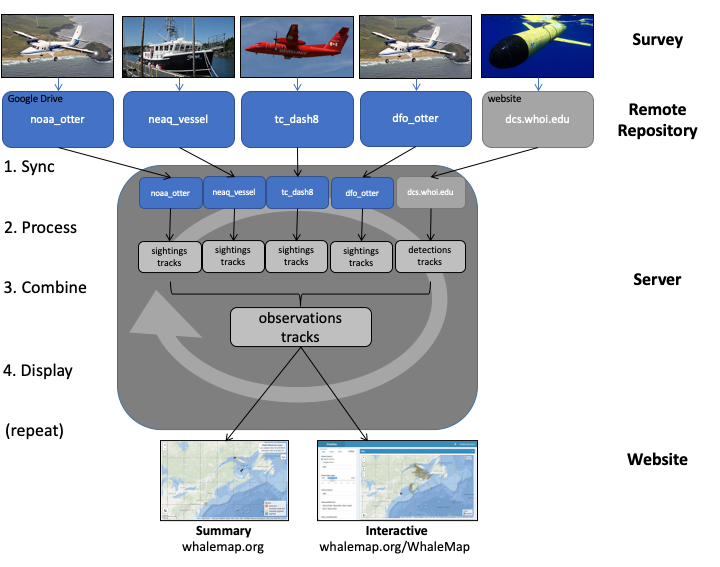

# Background

Baleen whales of the Northwest Atlantic live in a highly urbanized ocean. They attempt a slow recovery from commercial whaling amid risks from the infrastructure, pollution, and shifting environmental baseline associated with human exploitation of the natural world. These anthropogenic risks pose the greatest barriers to their recovery. Effective conservation and risk-reduction action requires near real-time knowledge of whale distribution measured using various methods including visual surveys from vessels or planes or acoustic surveys from autonomous platforms. The rapid collation and dissemination of whale detections and survey effort is critical but challenging given the number and variety of survey organizations and methodologies at work along the east coast of the US and Canada. There are long term databases for whale survey data, such as that maintained by the North Atlantic Right Whale Consortium (www.narwc.org), and crowd-source reporting tools (Whale Alert App) but `WhaleMap` is the only dedicated system specifically designed to collate and display all available near real-time whale detections and survey effort.

`WhaleMap` was designed with several specific goals:  
-	Incorporate whale detection and survey effort from all survey methods in near real-time  
-	Allow survey teams to easily contribute and retain complete control over their data  
-	Provide the latest data in an accurate, user-friendly, and publicly accessible format  
-	Operate transparently using open-source tools and with limited supervision  

Critically, `WhaleMap` does **not**:  
-	Perform any quality-control, or take responsibility for the veracity of information contributed  
-	Provide a long-term database for survey results  
-	Allow access to raw or processed data without approval from the data originator  

# System

The `WhaleMap` system workflow can be separated into data processing and visualization components (Figure 1). The following provides a brief overview of each. Additional details as well as specific references to all software used is available in the source code documentation.

## Data processing

Survey teams provide `WhaleMap` access to a remote repository of their choice (e.g., Google Drive, Dropbox, etc.) where they upload their survey data. The `WhaleMap` curator writes a custom script to extract the detection and effort data from each survey team and convert it to a common `WhaleMap` format. This method eases the burden on the survey teams by allowing any team to submit data in nearly any format, provided the format is consistent and well-documented. This is essential for rapid data collection, as survey teams in the field typically lack the time and resources to coerce their data into a common format.

A scheduled (`cron`) job regularly clones the data from the remote repositories (typically using `Rclone`) onto the `WhaleMap` server and uses `GNU Make` to dynamically and efficiently process the data from each platform and coerce it into a common format. Formatting errors in a remote data repository are automatically flagged and the contributor is notified. This ensures that any changes to the raw survey data quickly propagate through the entire system, which allows survey teams to retain complete control of their data and perform quality control as needed. It also guarantees that the `WhaleMap` always contains the latest available information.

## Visualization

Once the survey data are processed, they are visualized using two different methods. The first is the construction of self-contained html summary maps containing sufficient information to satisfy most casual viewers (typically the last 14-days of survey results). These can be conveniently embedded in various webpages and browsed without requiring server-side resources. These maps are dynamically regenerated as the final step in the data processing workflow, so they always contain the latest available information. The second visualization method is an interactive online application. This provides users with numerous tools with which to filter the latest processed data. The selected data are displayed in several formats including an interactive map, interactive timeseries plot, and table of summary statistics. 

# Conclusions

Since its launch in 2018, `WhaleMap` has been constantly refined and optimized to better serve the overall goal of providing a common source for all near real-time whale survey data in the Northwest Atlantic. It has demonstrably improved conservation outcomes for endangered whales in this region by optimizing research activities, facilitating dynamic risk-mitigation measures, and engaging with the ocean industry and the public. It is our hope that `WhaleMap` continues to serve the conservation community in perpetuity, and that this system can be readily adapted to benefit other regions facing similar conservation challenges.

# Figures

# Acknowledgements

We gratefully acknowledge the support of Pamela Emery, Stephanie Ratelle, Angelia Vanderlaan, Hilary Moors-Murphy and many other colleagues at Fisheries and Oceans Canada, as well as Tim Cole, Elizabeth Josephson, Leah Crowe, Christin Khan, Danielle Cholewiak and others at the NOAA Northeast Fisheries Science Center. This work would not have been possible without them. We also thank Mark Baumgartner, Kim Davies, and members of the Taggart lab for advice and helpful conversations. We are indebted to the fantastic community of open source developers that constructed many of the tools on which `WhaleMap` relies. These are referenced in detail in the system documentation. Finally, we give our most sincere thanks to the many survey teams and numerous agencies that continue to place their trust in this system and praise their tireless efforts to protect these vulnerable species. Supporting funds generously provided by Fisheries and Oceans Canada and the Natural Sciences and Engineering Council of Canada. 
